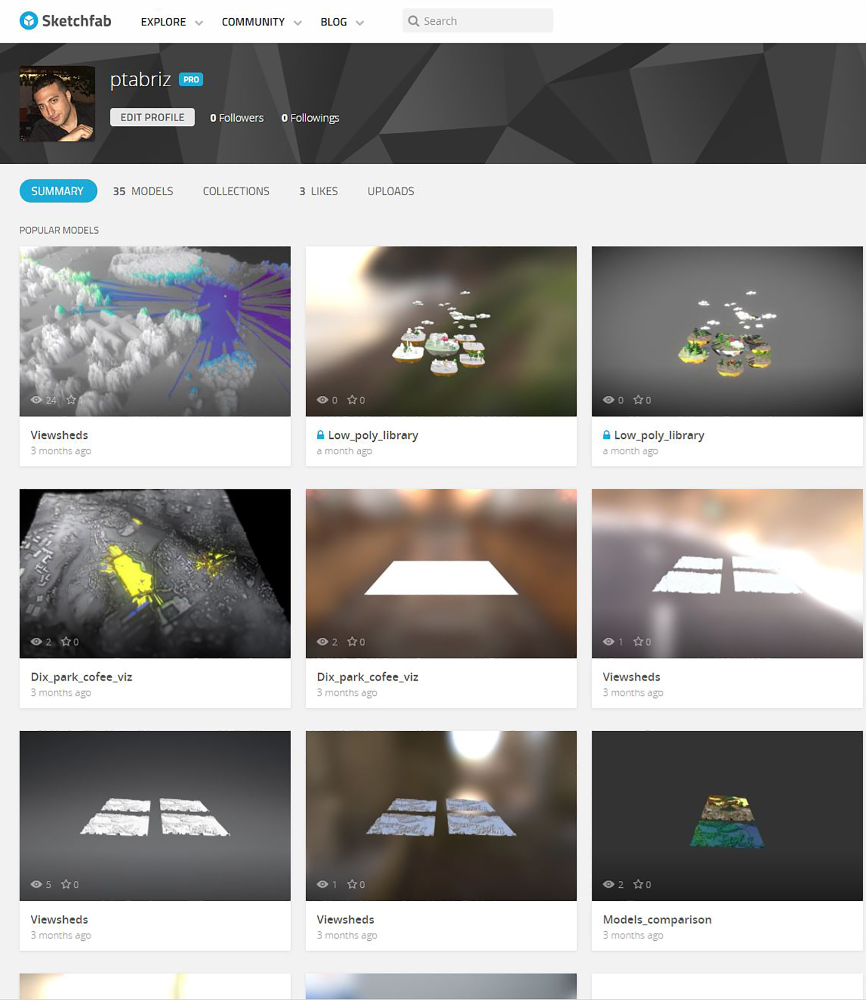

<section>

### Analytics and visualization with

## GRASS GIS, Blender and Tangible Landscape

#### Vaclav Petras, Anna Petrasova, Payam Tabrizian, Brendan Harmon, Helena Mitasova

[NCSU](http://www.ncsu.edu/ "North Carolina State University") [OSGeoREL](http://geospatial.ncsu.edu/osgeorel/ "NCSU OSGeo Research and Education Laboratory") at [Center for Geospatial Analytics](http://geospatial.ncsu.edu/ "Center for Geospatial Analytics")

July, 2017

</section>

<section>

## What to expect?

*   Intro to GRASS GIS, Blender, Tangible Landscape
*   Visualizing landscapes with GRASS GIS

*   batch visualization

*   Enhance your visualizations with 3D modeling in Blender
*   Tangibly explore landscapes

</section>

<section>

## GRASS GIS

</section>

<section>

## GRASS GIS

*   developed since 1984 as open source
*   runs everywhere (from Raspberry Pie to supercomputers, 32/64bit)
*   highly interoperable (Python, R, GDAL, QGIS)

</section>

<section>

## GRASS GIS: functionality

*   raster and 3D raster (volume) processing
*   vector topological processing and network analysis
*   imagery processing
*   spatio-temporal data handling

</section>

<section>

## GRASS GIS as geospatial development platform

*   user-contributed addons in Python, C, C++
*   specialized analyses in the fields of geomorphology, hydrology, landscape ecology, land change modeling, object segmentation, ...

 <small>Landform classification with addon [r.geomorphon](https://grass.osgeo.org/grass72/manuals/addons/r.geomorphon.html)</small></section>

<section>

## Blender

</section>

<section>

## Blender

*   Free and open source 3D modeling and game engine software

</section>

<section>

*   Easy scripting with Python

</section>

<section>

*   Addons for importing and publishing Geospatial data

 

<p2>                   BlenderGIS addon                                             Sketchfab addon</p2>

</section>

<section>

*   Real-time realistic rendering and Immersion at the viewport

 

<p3>   Virtual-reality addon with Oculus Dk2                  Real-time Cycles rendering</p3>

</section>

<section>

## Tangible Landscape

</section>

<section>

### Tangible Landscape: real-time coupling with GIS

<iframe data-autoplay="" <iframe="" width="560" height="315" src="https://www.youtube.com/embed/Cd3cCQTGer4?rel=0&amp;showinfo=0;loop=1&amp;playlist=Cd3cCQTGer4" frameborder="0" allowfullscreen=""></iframe>

Tangible Landscape couples a digital and a physical model through a continuous cycle of 3D scanning, geospatial modeling, and projection.

</section>

<section>

## Applications

</section>

<section>

### Immersive Tangible Landscape Modeling

Real-time updating a georeferenced 3D model of the landscape based on user interaction with Tangible Landscape

</section>

<section>

### Software Architecture

</section>

